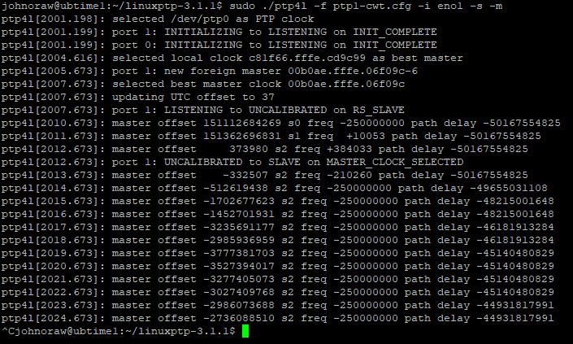

# KMNServer 
These are the build instruction for the time server in the KMN data centre. This server is intended to synch a local hardware clock with HEANet over PtP.

## Initial Setup
The hardware is a legacy Dell PE R520. The server was set to UEFI Boot and UB2204 was installed from a USB key. IP address is via DHCP and only interface *eno1* has a connection. Updates were carried out.
```
sudo apt update
sudo apt upgrade -y
```

The latest version of LinuxPTP is downloaded.
```
wget https://sourceforge.net/projects/linuxptp/files/v3.1/linuxptp-3.1.1.tgz/download

```
The download file is renamed and extracted.
- x for extract
- v for verbose
- z for gnuzip
- f for filename, which must be at the end.
```
mv download linuxptp-3.1.1.tgz
tar -xvzf ./linuxptp-3.1.1.tgz
```
**make** and **gcc** are installed.
```
sudo apt install make gcc
```
Working directory is changed to ./linuxptp-3.1.1

**make** is run, this should build the current version of the application. Check for errors!
```
cd linuxptp-3.1.1/
make
```
Any of the applications are run to ensure installation was succesful. 
```
./ptp4l
```

# Test to HEANet
Credit to Eoin Kenny in HEANet as the source of details below. Note that this test works fine on a home connection with NAT'd CPE. It did not work on a double NAT'd connection. Further investigation required.

A file is created *ptp1-cwt.cfg* in the linuxptp-3.1.1 directory.
```
# G.8275.2
# Precision time protocol telecom profile for phase/time 
# synchronization with partial timing support from the network
# 01MAY23
#
[global]
verbose                         1
dataset_comparison              G.8275.x
G.8275.defaultDS.localPriority  128
maxStepsRemoved                 255
logAnnounceInterval             0
masterOnly                      0
G.8275.portDS.localPriority     128
hybrid_e2e                      0
inhibit_multicast_service       1
unicast_listen                  1
unicast_req_duration            60
domainNumber                    44
#
# Customize the following for slave operation:
#
[unicast_master_table]
table_id                        1
logQueryInterval                2
UDPv4                           193.1.8.102
#
[eno1]
unicast_master_table            1
```
To test, the ptp4l command is used.
```
sudo ./ptp4l -f ptp1-cwt.cfg -i eno1 -s -m
```
Typical output is as shown.




## RPi Setup
To make this work on the Rpi CM4, follow the recipe for pi-ptp51, that was the RPi slave.
I changed the interface in *ptp1-cwt.cfg* from **eno1** to **eth0**


To run, I used 
```
sudo ./ptp4l -f ptp1-cwt.cfg -m -q -s
```
