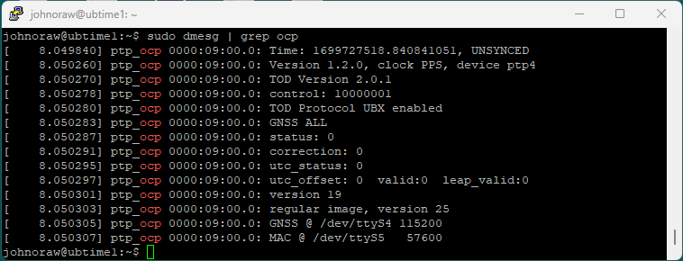

# Map the System #

## Test the card ##
Many of the examples on line require a rebuild of the kernel etc. This should not be required with UB2204. Test that the card is recognized using 

```
modprobe ptp_ocp
sudo dmesg | grep ocp
```
You should get a result as shown. Note we can see devices and speeds!




Use the command 
```
lspci
```
to idenify all the significant hardware devices. You will need to parse this manually. I needed to find my network cards first.

These are on my motherboard.

```
02:00.0 Ethernet controller: Broadcom Inc. and subsidiaries NetXtreme BCM5720 Gigabit Ethernet PCIe
02:00.1 Ethernet controller: Broadcom Inc. and subsidiaries NetXtreme BCM5720 Gigabit Ethernet PCIe
```

These are my high-end adapters, with SMA in and out for timing.

```
0a:00.0 Ethernet controller: Intel Corporation Ethernet Controller XXV710 for 25GbE SFP28 (rev 02)
0a:00.1 Ethernet controller: Intel Corporation Ethernet Controller XXV710 for 25GbE SFP28 (rev 02)
```
To find the OCP-TAP, I took an
```
lspci
```
before installing the card. You can also use the -v option to get more detail.

I compared it to the same command output after physical install. On my system, it showed up as 

```
09:00.0 Memory controller: Facebook, Inc. Device 0400
```