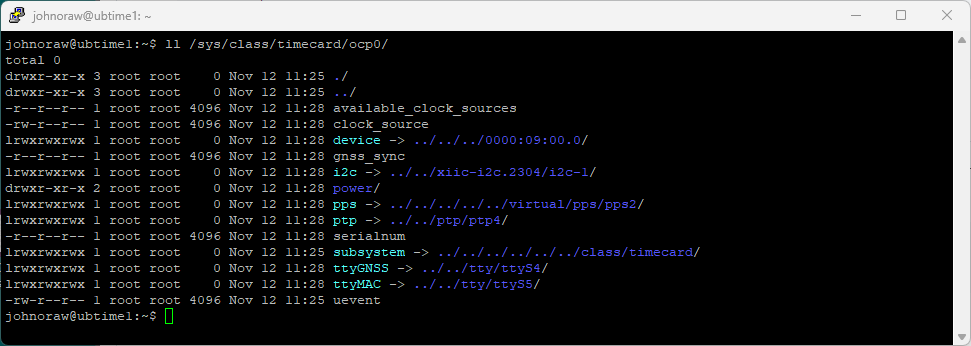

# Meta Server #
I used as a primary reference https://opencomputeproject.github.io/Time-Appliance-Project/docs/time-card/usage

First view all the sysfs parameters.

```
ls /sys/class/timecard/ocp0/
```



I installed tree so I could do a proper recce.

```
sudo apt install tree
```

Based on this, I have
- A new clock on ptp4
- GNSS on ssyS4
- MAC on ttyS5

I need to be root to do some of this work.
```
sudo -i
```
